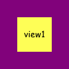
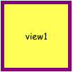
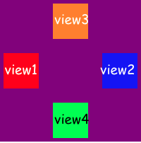
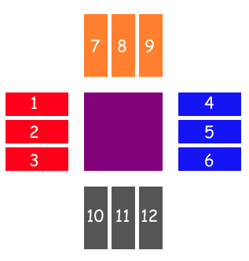
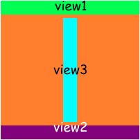

# ZLayout

[](http://cocoapods.org/pods/ZLayout)
### A lightweight library for layout views with Swift.

## Example

To run the example project, clone the repo, and run `pod install` from the Example directory first.

## Install via cocoapods

ZLayout is available through [CocoaPods](http://cocoapods.org). To install
it, simply add the following line to your Podfile:

```ruby
platform :ios, "8.0"
use_frameworks!
pod "ZLayout"
```
##Example


Let's replicate Instagram feed UI, but with more dose of cats.
After all setups of subviews this is what we should do for layout our views.
```swift
let ratio: CGFloat = 5/7
self.headerView.anchor(toParentEdge: .top, gravity: .center, width: .superView, height: 60)
self.avatarContainerView.anchor(toParentEdge: .left, gravity: .center, offset: CGPoint(x: 16, y: 0))
self.moreOptions.anchor(toParentEdge: .right, gravity: .center, width: .auto, height: .auto, offset: CGPoint(x: -16, y: 0))
self.nameLabel.alignAndFill(on: .rightOffset(16), relativeTo: avatarContainerView, withGravity: .center, stretchTo: moreOptions, trailingPadding: 16, size: .auto)
self.contentImageView.align(on: .bottom, relativeTo: headerView, withGravity: .center, width: .superView, height: .value(self.width * ratio))
self.actionsView.align(on: .bottom, relativeTo: contentImageView, withGravity: .center, width: .superView, height: 50)
self.likeImageVIew.anchor(toParentEdge: .left, gravity: .center, width: .auto, height: .auto, offset: CGPoint(x: 16, y: 0))
self.favoritesImageVIew.anchor(toParentEdge: .right, gravity: .center, width: .auto, height: .auto, offset: CGPoint(x: -16, y: 0))
self.commentImageVIew.align(on: .rightOffset(16), relativeTo: likeImageVIew, withGravity: .center, width: .auto, height: .auto)
self.viewsCountLabel.align(on: .bottom, relativeTo: actionsView, withGravity: .leftOffset(16), width: .auto, height: .auto)
self.textLabel.align(on: .bottomOffset(6), relativeTo: viewsCountLabel, withGravity: .left, width: .auto, height: .auto)
self.viewsAllCommentsLabel.align(on: .bottomOffset(3), relativeTo: textLabel, withGravity: .left, width: .auto, height: .auto)
self.dateLabel.align(on: .bottomOffset(3), relativeTo: viewsAllCommentsLabel, withGravity: .left, width: .auto, height: .auto)
```
Not bad for 20 lines of code!
There are few ways to layout your view via ZLayout.
## Anchoring
To place a view relative to the parent you can use anchoring. The most simple example is anchoring to center of parent.
```swift
view1.anchor(toParentEdge: .centerParent, width: 50, height: 50)
```



To fill superview you can use specific case of ZLayoutEdge named ```.all```. In this case width and height parameters will be ignored.
```swift
view1.anchor(toParentEdge: .all, inset: UIEdgeInsets(top: 5, left: 5, bottom: 5, right: 5))
```



You can do the same via ```.superView``` value for width and height.
```swift
centerView1.anchor(toParentEdge: .centerParent, width: .superView, height: .superView, inset: UIEdgeInsets(top: 5, left: 5, bottom: 5, right: 5))
```
Gravity means corner which will be centered by default but you can pick one of these:
```.center```,```.top```,```.bottom```,```.left``` or ```.right```
```swift
view1.anchor(toParentEdge: .left, width: 50, height: 50, offset: CGPoint(x: 5, y: 0))
view2.anchor(toParentEdge: .right, width: 50, height: 50, offset: CGPoint(x: -5, y: 0))
view3.anchor(toParentEdge: .top, width: 50, height: 50, offset: CGPoint(x: 0, y: 5))
view4.anchor(toParentEdge: .bottom, width: 50, height: 50, offset: CGPoint(x: 0, y: -5))
```


## Alignment
Another way to layout your views is align view relative to another one.
```swift
view1.align(on: .leftOffset(20), relativeTo: centerView, withGravity: .top, width: 80, height: 30)
view2.align(on: .leftOffset(20), relativeTo: centerView, withGravity: .center, width: 80, height: 30)
view3.align(on: .leftOffset(20), relativeTo: centerView, withGravity: .bottom, width: 80, height: 30)
view4.align(on: .rightOffset(20), relativeTo: centerView, withGravity: .top, width: 80, height: 30)
view5.align(on: .rightOffset(20), relativeTo: centerView, withGravity: .center, width: 80, height: 30)
view6.align(on: .rightOffset(20), relativeTo: centerView, withGravity: .bottom, width: 80, height: 30)
view7.align(on: .topOffset(20), relativeTo: centerView, withGravity: .left, width: 30, height: 80)
view8.align(on: .topOffset(20), relativeTo: centerView, withGravity: .right, width: 30, height: 80)
view9.align(on: .topOffset(20), relativeTo: centerView, withGravity: .center, width: 30, height: 80)
view10.align(on: .bottomOffset(20), relativeTo: centerView, withGravity: .left, width: 30, height: 80)
view11.align(on: .bottomOffset(20), relativeTo: centerView, withGravity: .right, width: 30, height: 80)
view12.align(on: .bottomOffset(20), relativeTo: centerView, withGravity: .center, width: 30, height: 80)
```



Also you can stretch view to another after alignment via ```alignAndFill``` method
```swift
view1.anchor(toParentEdge: .top, width: .superView, height: 20)
view2.anchor(toParentEdge: .bottom, width: .superView, height: 20)
view3.alignAndFill(on: .bottomOffset(5), relativeTo: topView, withGravity: .center, stretchTo: bottomView, trailingPadding: 5, size: 20)
```
Here size means width or height, it depends on alignment type.



## License

ZLayout is available under the MIT license. See the LICENSE file for more info.
